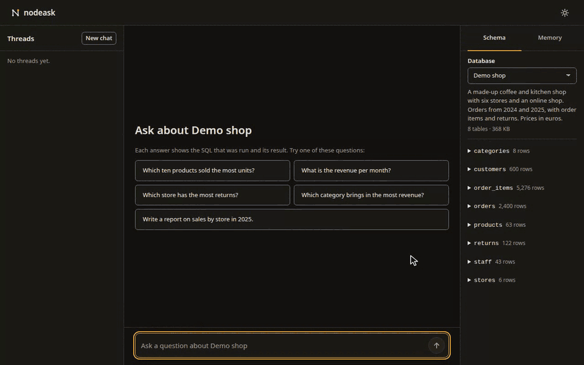
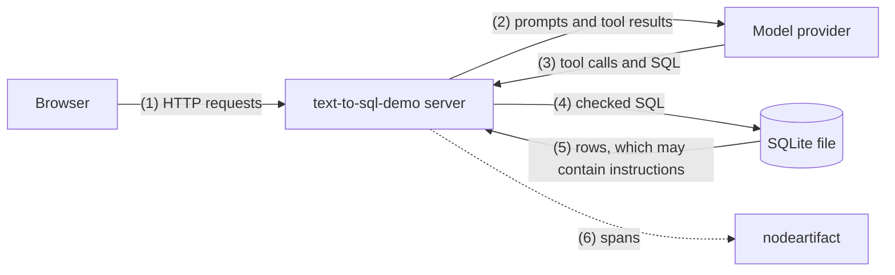

<picture>
  <source media="(prefers-color-scheme: dark)" srcset="assets/text-to-sql-demo-dark.svg">
  
</picture>

# text-to-sql-demo

> [!WARNING]
> Alpha (0.1.0a1). Anything may change between releases without a deprecation period, so pin a tag or a commit.

Text-to-SQL chat over SQLite, built on [nodestep](https://github.com/nodestep-ai/nodestep). Ask a question and you get the answer, the SQL that ran, the rows and sometimes a chart.



One Python process serves a FastAPI API and a Svelte 5 web app. The agent is a nodestep graph that reads the schema, runs checked read-only SQL, draws charts and asks when a question is unclear. It also keeps a [memory](#memory), loads [skills](#skills) and hands the parts of a bigger question to [sub-agents](#sub-agents).

## Setup

The app is not on PyPI, so it runs from a clone. You need Python 3.12+, [uv](https://docs.astral.sh/uv/) and Node.js 22.18+. nodestep and nodeartifact are installed from checkouts next to this one, so clone all three into one folder:

```sh
git clone https://github.com/nodestep-ai/nodestep.git
git clone https://github.com/nodestep-ai/nodeartifact.git
git clone https://github.com/nodestep-ai/text-to-sql-demo.git
cd text-to-sql-demo
uv sync --locked
uv run --no-sync python scripts/make_demo_db.py
cd web && npm ci --ignore-scripts && npm run build && cd ..
```

`make_demo_db.py` writes the demo database to `data/databases/demo_shop.sqlite`, and `npm run build` writes the web app to `web/dist`.

## Demo

```sh
uv run --no-sync text-to-sql-demo demo
```

Open http://127.0.0.1:8000. A script plays the model, so no API key is needed. The agent, the SQL checks and the charts are the real ones, on `demo_shop`, a generated database of a made-up coffee and kitchen shop. The empty chat offers the five questions the script answers:

| Question | What it shows |
|---|---|
| Which ten products sold the most units? | A query and a bar chart |
| What is the revenue per month? | A line chart, and a memory search for "revenue" |
| Which store has the most returns? | A query that fails the checks, then the corrected one |
| Which category brings in the most revenue? | A clarification with three proposals; free text works too |
| Write a report on sales by store in 2025. | The `report` skill and three sub-agents, then a slow answer to try the stop button |

- Other wording works too, since the script picks the answer by keywords. Any other message lists the tables.
- A message that starts with "Remember" saves the rest to the memory, and one that starts with "Forget" deletes it.
- The demo serves only `demo_shop`. Its threads and memory go to a temporary folder that is deleted when it stops.

## With a model

Copy `.env.example` to `.env`, set `OPENAI_API_KEY` in it, then start the app with the file:

```sh
cp .env.example .env
uv run --no-sync --env-file .env text-to-sql-demo serve
```

Nothing loads `.env` on its own, hence `--env-file`. The model is `gpt-6-luna` unless you set `TEXT_TO_SQL_DEMO_MODEL`. `serve` and `demo` both bind `127.0.0.1:8000`; change that with `--host` and `--port`. Without the built web app in `web/dist`, only the API runs.

- The agent sends the schema, three sample values per column and the query results to OpenAI.
- There is no authentication: anyone who can reach the port can query your databases and read every thread. See [Safety](#safety).

## Your own databases

Copy a SQLite file into `data/databases/` as `<id>.sqlite`:

```sh
cp ~/sales.sqlite data/databases/sales.sqlite
```

It shows up without a restart. An optional `sales.json` next to it sets a title, a description and the example questions the web app offers:

```json
{"title": "Sales", "description": "Orders and invoices since 2020.", "examples": ["Which month had the most orders?"]}
```

- The id uses only lowercase letters, digits, `_` and `-`. Other files, `.db` included, are ignored, and so are symlinks that point outside the folder.
- Databases are opened read-only. A thread stays on the database it started with.
- A database in WAL mode is skipped when the app cannot write to the folder. Run `PRAGMA journal_mode = DELETE` on it once.

## Memory

Ask the agent to remember something, and it uses it in later answers. One memory is shared by every thread and database.

- "Remember that revenue counts completed orders only." saves it. The agent saves only when you ask.
- Before it queries, the agent searches the memory with `search_memory`, BM25 over the title and the text. An answer that uses a memory says "From memory: ...".
- "Forget that revenue counts completed orders only." or "Do not remember that" deletes it.

The Memory tab next to Schema lists, adds, edits and deletes memories by hand. A memory has a key (up to 60 letters, digits, `-` and `_`), a title (up to 120 characters) and text (up to 2,000). Each one is a JSON file in `memories/global/` inside `TEXT_TO_SQL_DEMO_MEMORY_DIR`: nodestep's [`FilesystemMemory`](https://nodestep-ai.github.io/nodestep/concepts/workspace/#memory) with the scope `global`.

## Skills

A skill is a `SKILL.md` with instructions for one kind of task. Add your own as a folder with a `SKILL.md`, such as `data/skills/refunds/SKILL.md`, and restart, since skills are read at start:

```markdown
---
name: refunds
description: How refunds are counted in our shop
---

Count a refund in the month of the return, not of the order.
```

The model sees each skill's name and description and loads the full text with `load_skill` when it needs it ([`FilesystemSkills`](https://nodestep-ai.github.io/nodestep/concepts/middleware/#built-in-middleware)). Two ship in [`src/text_to_sql_demo/skills/`](src/text_to_sql_demo/skills/): `report`, how to put together a sales report, and `sqlite-dates`, SQLite date functions and periods.

- Your skills are read from `skills/` in `TEXT_TO_SQL_DEMO_DATA_DIR`, or from `TEXT_TO_SQL_DEMO_SKILLS_DIR` when it is set.
- A file without `name` and `description`, or a duplicate name, stops the server with exit code 2 and names the file.

## Sub-agents

For a question with separate parts, such as a report, the agent calls `analyze_topics` with 2 to 4 topics. Each topic runs at the same time in its own sub-agent, a nodestep graph with the read-only SQL tools on the thread's database, started with `ctx.spawn` and awaited with `ctx.gather` ([Sub-agents](https://nodestep-ai.github.io/nodestep/concepts/sub-agents/)). The agent writes the answer from what they found.

- A sub-agent makes at most 10 tool calls in 23 steps. One `analyze_topics` call gets 300 seconds for all of its sub-agents.
- An answer makes at most two `analyze_topics` calls, and each counts toward the answer's 20 tool calls.
- Stopping the answer stops the sub-agents.
- In nodeartifact each sub-agent is its own run under the `delegate` step of the answer's trace.

## Tracing

Start nodeartifact in one terminal:

```sh
uvx --from "nodeartifact[server] @ git+https://github.com/nodestep-ai/nodeartifact" nodeartifact serve
```

and the app in another, with `serve` or `demo`:

```sh
TEXT_TO_SQL_DEMO_OTLP_ENDPOINT=http://127.0.0.1:4318 uv run --no-sync text-to-sql-demo demo
```

The runs show up at http://127.0.0.1:4318 under the service `text-to-sql-demo` while they run. The traces hold the model messages and the query results.

## Docker

`docker/compose.yaml` runs the app and nodeartifact together. Compose builds from the folder that holds the three checkouts, with this one in `text-to-sql-demo/`, so clone them as in [Setup](#setup). From `text-to-sql-demo/docker/`, run the demo:

```sh
docker compose -f compose.yaml -f compose.demo.yaml up --build
```

For the model, put `OPENAI_API_KEY` in `text-to-sql-demo/.env` and run:

```sh
docker compose up --build
```

The app is on http://127.0.0.1:8000 and its traces on http://127.0.0.1:4318, both published on `127.0.0.1` only. `docker compose down -v` also deletes the stored threads, memory and traces.

Mount your own databases and skills, for example in `docker/compose.override.yaml`, which plain `docker compose up` reads too:

```yaml
services:
  text-to-sql-demo:
    volumes:
      - /path/to/sales.sqlite:/data/databases/sales.sqlite
      - /path/to/refunds:/data/skills/refunds
```

The container runs as user 10001, which must be able to read them.

## Settings

Settings are environment variables only; `.env.example` lists them.

| Variable | Default | Meaning |
|---|---|---|
| `OPENAI_API_KEY` | required for `serve` | OpenAI API key |
| `TEXT_TO_SQL_DEMO_MODEL` | `gpt-6-luna` | Model the agent uses with `serve` |
| `TEXT_TO_SQL_DEMO_REASONING_EFFORT` | `none` | Reasoning effort sent with every model request. The agent uses the Chat Completions API, where `gpt-6-luna` takes tools only with `none` |
| `TEXT_TO_SQL_DEMO_DATA_DIR` | `data` | Databases, threads, agent state, memory and skills |
| `TEXT_TO_SQL_DEMO_MEMORY_DIR` | `TEXT_TO_SQL_DEMO_DATA_DIR` | Folder whose `memories/` holds the memory |
| `TEXT_TO_SQL_DEMO_SKILLS_DIR` | `skills/` in `TEXT_TO_SQL_DEMO_DATA_DIR` | Your own skills; when set, a folder that exists |
| `TEXT_TO_SQL_DEMO_MAX_ROWS` | `200` | Most rows a query returns; a longer result is cut and marked `truncated` |
| `TEXT_TO_SQL_DEMO_QUERY_TIMEOUT_MS` | `5000` | Time limit for one query |
| `TEXT_TO_SQL_DEMO_WEB_DIST` | `web/dist` | Built web app |
| `TEXT_TO_SQL_DEMO_OTLP_ENDPOINT` | unset | nodeartifact address to send traces to |

- The OpenAI client also reads `OPENAI_BASE_URL`, `OPENAI_ORG_ID`, `OPENAI_PROJECT_ID`, `OPENAI_TIMEOUT` and `OPENAI_MAX_RETRIES`.
- Relative paths are resolved from the folder you start the server in.
- An invalid value stops the server with exit code 2 and names the variable.

`TEXT_TO_SQL_DEMO_DATA_DIR` holds `databases/`, `threads.json` (the threads and every version of an edited turn), `state.jsonl` (the agent's checkpoints, nodestep's `FilesystemStateStore`), `agent.json` (which checkpoint each branch starts from), `memories/` and `skills/`.

## Safety

Run the app on one trusted machine. It has no authentication, and the model's SQL is untrusted.



Data crosses a boundary at each numbered edge. Before any SQL runs, `safety.py` lets through one `SELECT` or `WITH ... SELECT` on known tables and columns, and `execution.py` runs it on a read-only connection under a SQLite authorizer. [Security](docs/security.md) has the threats, the limits and the known gaps.

## API

The web app uses a JSON API under `/api`, which streams each answer as server-sent events. [API](docs/api.md) has the routes, the events and the error codes.

## Development

```sh
uv run --no-sync pytest -q
uv run --no-sync ruff check .
uv run --no-sync ruff format --check .
uv run --no-sync ty check .
```

The tests never call OpenAI. For the web app, run `npm test`, `npm run check` and `npm run build` in `web/`. For live reload, start `text-to-sql-demo demo`, then `npm run dev` in `web/`; the dev server forwards `/api` to port 8000.

`web/src/nodestep-design/nodestep.css` is a copy of `nodestep.css` from [nodestep-stylesheet](https://github.com/nodestep-ai/nodestep-stylesheet); change it there.

Releases are made by CI from `CHANGELOG.md`, and nothing goes to PyPI. The changelog rules are in [CONTRIBUTING.md](CONTRIBUTING.md).

## License

MIT. See [LICENSE](LICENSE).
