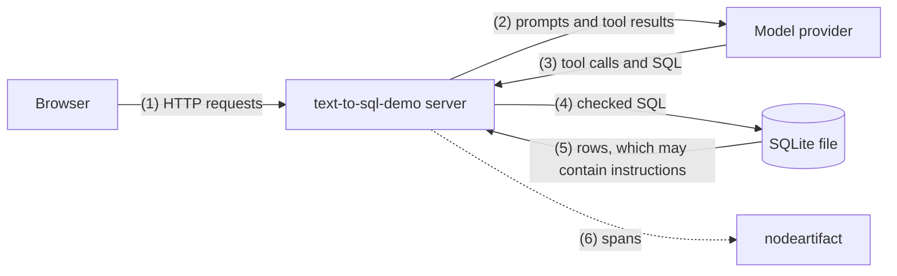

# Security

text-to-sql-demo 0.1.0a1 is meant for one trusted machine. There is no authentication: anyone who can reach the port can list the databases, read every thread, change the memory and spend your OpenAI credits. The server binds `127.0.0.1` by default, and `docker/compose.yaml` publishes its ports on `127.0.0.1` only.

The question, the model's output and every value read from a database are untrusted. A cell value can hold instructions.

## Trust boundaries

Data crosses a boundary at each numbered edge. The threats below are about edges (3) and (5) for prompt injection, (2) and (6) for exfiltration, and (4) for runaway queries.

## Prompt injection

Text in the question or in the data tells the model to write SQL that changes the database, attaches another file or loads an extension. Two layers stop it, each on its own:

- [`safety.py`](https://github.com/nodestep-ai/text-to-sql-demo/blob/main/src/text_to_sql_demo/safety.py) lets through one `SELECT` or `WITH ... SELECT` on known tables and columns, and nothing else. The query that runs is regenerated from the checked syntax tree.
- [`execution.py`](https://github.com/nodestep-ai/text-to-sql-demo/blob/main/src/text_to_sql_demo/execution.py) runs it on a read-only connection (`mode=ro`, `PRAGMA query_only = ON`) under a SQLite authorizer that allows only reads of that database's tables and a fixed list of functions, without `load_extension`.

No tool takes a database or a path; a thread stays on the database it started with.

An injected instruction can still make the model read any table of that database or write a wrong answer. The answer always shows the SQL that ran and its rows. Model text and cell values are shown as plain text, and markup in the data does not run.

## Memory and skills

An injected instruction can make the model save a memory that steers every later answer, or delete one. The system prompt allows that only when you ask, but nothing enforces it in code. Every save and delete shows as a row in the answer, and the Memory tab lists what is there.

Skills are trusted like the system prompt.

## Data exfiltration

- With `serve`, everything the agent reads goes to OpenAI: the schema, three sample values per column and query results of up to `TEXT_TO_SQL_DEMO_MAX_ROWS` rows. The sub-agents send their query results too. `OPENAI_BASE_URL` can point the client at an OpenAI-compatible endpoint you run.
- No tool makes a network request or writes a file other than the memory, and SQL cannot attach a database or load an extension. A URL in an answer is plain text and loads nothing.
- Traces hold the model messages and query results, and nodeartifact has no authentication either.

## Runaway queries and agents

| Limit | Value |
|---|---|
| Time per query | `TEXT_TO_SQL_DEMO_QUERY_TIMEOUT_MS`, 5,000 ms by default |
| Rows per result | `TEXT_TO_SQL_DEMO_MAX_ROWS`, 200 by default; a cut result is marked `truncated` |
| Bytes per result | 2,000,000 |
| Bytes per value | 1,000,000 |
| SQL text | 20,000 characters |
| Tool calls per answer | 20, `analyze_topics` included |
| Sub-agents | 2 `analyze_topics` calls per answer, 4 sub-agents per call, 10 tool calls each, 300 seconds per call |
| Answers per thread | 1 at a time; other requests get 409 `run_active` |

Stop, or a client that closes the stream, cancels the answer and its sub-agents. A query that is already running keeps going in its worker thread until it ends or hits the time limit.

## Known gaps

Not handled in 0.1.0a1.

- **No authentication.**
- **No Host header check.** A page that uses DNS rebinding could reach the API on `127.0.0.1` and read its answers.
- **No memory limit for queries.** The time limit bounds CPU time, but a large sort or grouping can use memory until the query ends.
- **Only some of SQLite's settings for untrusted files.** `PRAGMA trusted_schema = OFF`, `PRAGMA cell_size_check = ON` and the other limits from [SQLite: Defense against the dark arts](https://www.sqlite.org/security.html) are not set.
- **No limit across threads or clients.** Nothing bounds how many answers run at once or how many tokens are spent per day.
